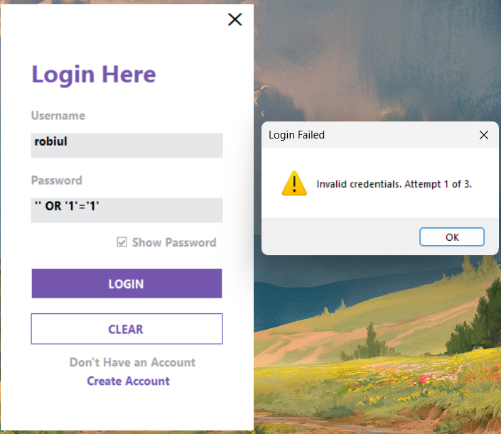

## Task 6: SQL Injection Demo

### 1. The Vulnerability
In the original, insecure version of the application, the SQL query was constructed using simple string concatenation. This allows user input to alter the logic of the SQL statement.

**Vulnerable Code Snippet:**
```csharp
string query = "SELECT * FROM Users WHERE Username = '" + txtUsername.Text + "' AND Password = '" + txtPassword.Text + "'";
```


**But After Fixing:**
```csharp
string query = "SELECT FullName FROM dbo.Users WHERE Username = @Username AND PasswordHash = @PasswordHash";
using (SqlCommand cmd = new SqlCommand(query, con))
{
    cmd.Parameters.AddWithValue("@Username", txtUsername.Text);
    cmd.Parameters.AddWithValue("@PasswordHash", hashedPassword);
    
    // ... execute query
}
```
